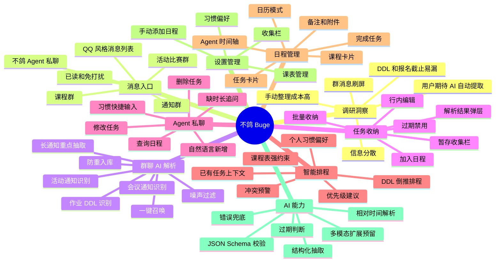
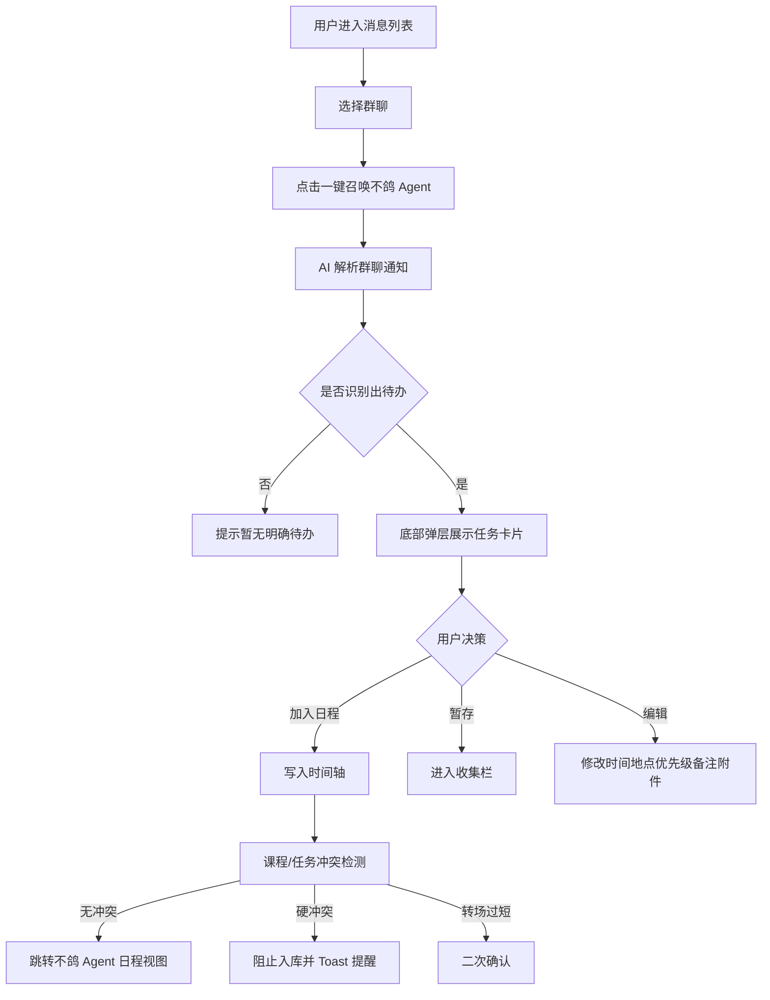

# 不鸽 Buge Demo PRD

## 1. 封面信息

- 产品名称：不鸽 Buge
- 产品定位：AI 原生校园行动管家
- 目标用户：以大学生为核心，重点覆盖课程、社团/学生工作、比赛/科研、实习求职等多事务并行人群。
- Demo 链接：见项目 README 在线体验链接。
- 调研来源：前期问卷《大学生校园信息接收与任务遗漏情况调研》，问卷 ID 26410811，总回收 44 份。
- Demo 形态：Next.js 高保真移动端前端 Demo，包含 AI 接口链路与本地状态流转。

## 2. 调研洞察与问题定义

### 2.1 样本概况

- 样本以大二学生为主：大二 32 人，占 72.7%；大一 15.9%；大三 9.1%；研究生及以上 2.3%。
- 校园事务复杂度并不只来自课程：仅“主要只有课程任务”的用户占 31.8%，其余用户存在多事务并行、社团/学生工作、比赛/科研、实习求职等额外负担。
- 这说明产品首要场景应聚焦“高校中低年级学生的日常通知和 DDL 管理”，同时兼容多事务并行用户。

### 2.2 信息接收渠道洞察

| 渠道 | 占比 | 对产品的启发 |
| --- | ---: | --- |
| 微信群 | 97.7% | 信息入口高度集中在即时通讯群，需要支持群聊语义解析。 |
| 班委/同学转发 | 68.2% | 通知常经过二次转发，需要从非标准文本中提取任务。 |
| QQ 群 | 52.3% | QQ 仍是重要校园群入口，适合作为 Demo 的核心入口。 |
| 教务系统/学校官网 | 50.0% | 后续应支持半结构化网页/系统信息导入。 |
| 微信公众号 | 40.9% | 长通知、图文通知需要摘要与任务提取。 |
| 老师私聊 | 18.2% | 点对点消息也存在任务转化需求。 |
| 海报/截图 | 9.1% | 图片型信息可作为后续 OCR/多模态扩展。 |

### 2.3 高频遗漏信息

- 报名截止时间：56.8%。
- 材料提交要求：45.5%。
- 社团/活动通知：43.2%。
- 比赛/讲座信息：40.9%。
- 作业/实验提交：31.8%。
- 考试/测验安排：13.6%。

结论：用户最容易漏的不是“日程本身”，而是通知里的可执行动作、截止时间、材料要求和机会型信息。因此产品不能只做日历录入，必须做“通知理解 -> 任务提取 -> 风险提醒 -> 行动建议”的闭环。

### 2.4 遗漏经历与原因

- 84.1% 用户有过“看到通知，但最后忘了处理”的经历，其中 27.3% 经常发生，56.8% 偶尔发生。
- 主要原因：
  - 群消息太多，被刷掉：68.2%。
  - 信息分散在多个平台：59.1%。
  - 看到了但没及时记录：52.3%。
  - 通知太长，看不出重点：47.7%。
  - 多个 DDL 冲突：36.4%。
  - 记录了但没有提醒：31.8%。
  - 不知道哪件事更优先：22.7%。

结论：遗漏并非单纯记忆力问题，而是“信息噪声、跨平台分散、手动整理成本、优先级判断、提醒链路”共同造成。

### 2.5 当前替代方案与不足

- 当前管理方式分散：备忘录 44.2%、记在脑子里 34.9%、日历/提醒事项 34.9%、收藏聊天/保存截图 30.2%。
- 专门待办 App 使用率仅 4.7%，说明传统工具迁移成本高，用户更希望在原信息流里低摩擦完成任务收纳。
- 现有方法的最大问题：
  - 信息太碎，整理成本高：59.1%。
  - 需要手动整理，太麻烦：54.5%。
  - 提醒不够及时：36.4%。
  - 还是容易漏：34.1%。
  - 不能自动判断优先级：27.3%。
  - 不能发现 DDL 冲突：18.2%。

### 2.6 用户对 AI 工具的期待

- 自动生成待办事项：70.5%。
- 自动提取 DDL：68.2%。
- 自动按紧急程度排序：68.2%。
- 提醒时间冲突/遗漏风险：65.9%。
- 自动生成本周行动计划：56.8%。
- 总结长通知重点：43.2%。
- 生成回复老师/报名文案：31.8%。
- 识别值得参加的比赛/活动机会：31.8%。

最打动用户的功能集中在：
- AI 自动看群并提取任务：65.9%。
- 自动生成本周/今晚行动计划：63.6%。
- 截止时间/冲突预警：63.6%。

若以 QQ 为核心入口，同时支持导入微信、公众号、PDF、海报等信息，86.4% 用户表示非常愿意或比较愿意尝试。

### 2.7 问题定义

大学生每天从微信群、QQ 群、班委转发、教务系统、公众号、PDF、截图、海报中接收大量校园信息。现有处理方式依赖人工阅读、筛选、记录、判断优先级和设置提醒，导致 DDL、报名截止、材料提交、活动机会被遗漏。用户需要一个贴近原始信息流、低操作成本、能自动理解上下文并转化为行动计划的 AI 助手。

## 3. 用户画像与核心场景

### 3.1 目标用户

- 主目标用户：大一至大三本科生，尤其是课程、社团、比赛、科研、学生工作多线并行的学生。
- 次目标用户：班委、学生干部、竞赛参与者、求职/实习阶段学生。
- 典型特征：
  - 高频使用微信/QQ 群接收通知。
  - 通知来源多、格式杂、重复转发多。
  - 有记录意愿，但难以持续维护待办系统。
  - 对 AI 自动提取、排序、冲突预警接受度高。

### 3.2 用户痛点

- 不知道哪里有重要信息：群消息刷屏、渠道分散。
- 不知道通知里真正要做什么：长通知难抓重点，材料要求容易漏。
- 不知道什么时候做：DDL 与课程/任务冲突，缺少倒推排程。
- 不知道先做哪件：多任务并行时优先级不清。
- 记录了也可能忘：提醒链路断裂，记录工具和消息入口分离。

### 3.3 核心使用场景

- 场景一：用户在 QQ/微信群里看到老师发布作业 DDL，点击召唤不鸽，AI 自动提取任务、截止时间、提交平台并加入日程。
- 场景二：用户收到比赛/讲座/报名通知，AI 提取活动时间、报名截止、材料要求，并提示是否值得加入收集栏。
- 场景三：用户对不鸽说“明晚安排一下健身/复习”，AI 结合课表、已有任务、习惯偏好安排空闲时间。
- 场景四：多个 DDL 或课程时间发生冲突时，系统高亮冲突并给出风险提醒。
- 场景五：用户暂时不确定是否参加活动，将任务暂存到收集栏，之后再安排到日程。

## 4. 产品方案设计

### 4.1 产品概述

不鸽 Buge 是一个嵌入校园消息场景的 AI 行动管家。它将群聊通知、自然语言输入、课程表、个人习惯转化为结构化任务，并通过日程时间轴、日历视图、收集栏、冲突预警帮助学生完成任务闭环。

一句话说明：不鸽把校园通知里的“信息”自动变成“可执行行动”。

### 4.2 产品架构思维导图

### 4.3 核心功能模块

| 模块 | 核心能力 | 解决的调研痛点 |
| --- | --- | --- |
| 消息与群聊入口 | QQ 风格消息列表、群聊切换、已读/免打扰 | 贴近用户原始信息流，降低工具迁移成本。 |
| 群聊 AI 解析 | 一键提取任务、DDL、地点、材料要求、来源消息 | 对应“群消息太多”“通知太长”“看到了但没记录”。 |
| AI 解析结果确认 | 行内编辑、加入日程、暂存、批量收纳、移出 | 给用户确认权，避免 AI 自动入库造成误操作。 |
| 不鸽 Agent 私聊 | 自然语言 CRUD、查询、习惯排程 | 将传统表单操作变成对话式管理。 |
| 智能排程与冲突预警 | 课程表强约束、任务冲突、转场提醒、DDL 倒推 | 对应“多个 DDL 冲突”“提醒不及时”“优先级不清”。 |
| 时间轴与日历 | 日程视图、月视图、课程/任务统一展示 | 把分散通知沉淀为可扫描的行动计划。 |
| 设置与管理 | 收集栏、课表、习惯、手动添加 | 覆盖待定任务、课程底座、个性化偏好和兜底录入。 |

### 4.4 用户关键流程

## 5. 功能需求明细

### 5.1 P0 必做能力

- 群聊任务解析：从静态模拟群聊中提取活动、会议、作业、课程等待办。
- DDL 识别：识别“前、截止、逾期不候、提交”等 deadline 语义。
- 任务结构化：输出名称、日期、开始时间、结束时间、地点、任务类型、来源消息、过期状态。
- 解析确认弹层：支持展开、编辑、加入日程、暂存、批量收纳。
- 不鸽 Agent 私聊：支持自然语言新建、修改、删除、查询日程。
- 课程表强约束：排程和手动添加时检测课程冲突。
- 任务冲突预警：任务与任务、任务与课程发生时间重叠时提示。
- 收集栏：支持待定任务暂存和二次安排。
- 时间轴：课程和任务按时间统一展示。

### 5.2 P1 增强能力

- 长通知摘要：提取通知重点、材料要求、报名条件。
- 优先级建议：根据 DDL、任务类型、时间临近程度生成 P0/P1/P2。
- DDL 倒推排程：对截止任务自动预留准备时间。
- 个人习惯排程：根据长期习惯生成建议时间和快捷按钮。
- 日历模式：用月视图展示任务、课程、冲突和今日标识。
- 转场提醒：相邻任务间隔小于 10 分钟时二次确认。
- 重复任务覆盖确认：识别已存在任务并提示是否覆盖。

### 5.3 P2 后续扩展

- 微信群、公众号、教务系统信息导入。
- PDF、截图、海报 OCR/多模态识别。
- 自动生成本周/今晚行动计划。
- 机会型信息识别：比赛、讲座、活动是否值得参加。
- 一键生成报名/回复老师文案。
- 系统级通知提醒和跨设备同步。
- 账号体系、云端持久化和真实 IM 平台接入。

## 6. AI 原生能力说明

### 6.1 AI 能力清单

- 群聊信息结构化：从噪声消息中提取可执行任务。
- 自然语言日程 CRUD：根据用户一句话完成新增、修改、删除、查询。
- 相对时间解析：理解今天、明天、下周三、明晚等表达。
- 过期任务判断：结合当前时间判断任务是否已过期。
- DDL 倒推排程：为截止任务预留准备时间。
- 课程/任务上下文匹配：修改或删除时从现有任务与课程目录匹配目标。
- 习惯偏好调度：结合用户长期习惯安排任务。
- JSON Schema 校验：约束 AI 输出结构，降低不可控返回。
- 异常兜底：处理超时、网络异常、JSON 解析失败、Schema 校验失败、API Key 缺失。

### 6.2 AI 如何解决痛点

| 用户痛点 | AI 解决方式 |
| --- | --- |
| 群消息太多，被刷掉 | 一键解析整段群聊，过滤闲聊和重复信息。 |
| 信息分散在多个平台 | 当前 Demo 先覆盖 QQ 群，后续扩展微信、公众号、PDF、海报导入。 |
| 看到了但没记录 | 解析结果直接转入日程或收集栏。 |
| 通知太长，看不出重点 | 抽取时间、地点、材料、截止、行动项。 |
| 多个 DDL 冲突 | 写入日程前做冲突检测和风险提示。 |
| 记录了但没有提醒 | DDL 任务自动带提前提醒标识，后续可接系统推送。 |
| 不知道优先级 | 基于任务类型、截止时间和冲突风险给出优先级建议。 |

### 6.3 AI 技术方案

- 前端通过 `/api/chat` 统一调用 AI 解析服务。
- AI 场景分为：
  - `group_parse`：群聊长文本任务提取。
  - `quick_task`：明确自然语言日程指令。
  - `habit_schedule`：结合习惯偏好的模糊排程。
- 服务端使用 DeepSeek Chat 兼容 OpenAI SDK 调用。
- Zod Schema 校验 AI 返回结构。
- 前端 Zustand 保存任务、收集栏、课程、习惯、已处理消息。

## 7. 数据对象

### 7.1 Task 任务

- id
- title
- date
- time
- endTime
- location
- priority
- reminder
- sourceMessageId
- isExpired
- insight
- notes
- attachments

### 7.2 Course 课程

- id
- name
- dayOfWeek
- startTime
- endTime
- location

### 7.3 Habit 习惯

- id
- icon
- content

### 7.4 ProcessedMessage 已处理消息

- sourceMessageId 列表。

## 8. 验收标准与指标

### 8.1 Demo 验收标准

- 用户可从消息列表进入三个模拟群聊和不鸽 Agent 私聊。
- 用户可点击一键召唤 Agent，从群聊中提取至少一个可执行任务。
- 用户可在解析弹层中完成编辑、加入日程、暂存、批量收纳。
- 已加入日程的来源消息在群聊中显示“已添加入库”。
- 用户可在不鸽 Agent 私聊中用自然语言新增、修改、删除、查询任务。
- 任务与课程或任务发生重叠时，系统阻止或高亮提示。
- 收集栏、课表管理、习惯设置、手动添加日程可正常打开并完成基础操作。

### 8.2 产品效果指标

- 任务提取成功率：群聊通知中明确待办被正确提取的比例。
- 任务入库转化率：解析结果中被加入日程或暂存的任务比例。
- 冲突拦截率：系统识别并提示时间冲突的比例。
- 手动整理减少量：用户从通知到日程录入所需步骤数下降。
- 用户意愿指标：围绕“是否愿意尝试 QQ 核心入口 + 多源导入产品”，调研中正向意愿为 86.4%，可作为后续验证基线。

## 9. 创新与差异化

- 不是独立待办 App，而是嵌入校园信息流的 AI 行动管家。
- 从“通知阅读”升级为“行动项提取 + 排程 + 风险预警”。
- 支持“加入日程 / 暂存收集栏”双轨收纳，兼容待定事项。
- 课程表作为强约束参与排程，贴合学生真实时间结构。
- AI 对话直接完成新增、修改、删除、查询，减少表单操作。
- 调研显示用户最期待 AI 自动提取 DDL、生成待办、紧急排序和冲突预警，当前 Demo 的核心功能与需求高度匹配。

## 10. 落地可行性与 Demo 边界

### 10.1 当前可行性

- 前端架构已具备完整高保真交互。
- Zustand 可支撑 Demo 级本地状态流转。
- AI 接口已具备场景化 Prompt、结构化输出、Schema 校验与异常处理。
- 静态群聊数据可覆盖会议、通知、课程、作业 DDL、噪声过滤等核心演示场景。

### 10.2 Demo 边界

- 当前为高保真前端 Demo，不包含真实账号体系与服务端持久化。
- 课表导入为模拟导入。
- 群聊入口为静态模拟数据，不是真实 QQ/微信接入。
- PDF、海报、截图识别属于后续多模态扩展，当前 PRD 作为 P2 能力保留。
- 提醒能力目前表现为任务字段与 UI 标识，未接入系统级推送。

